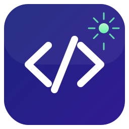
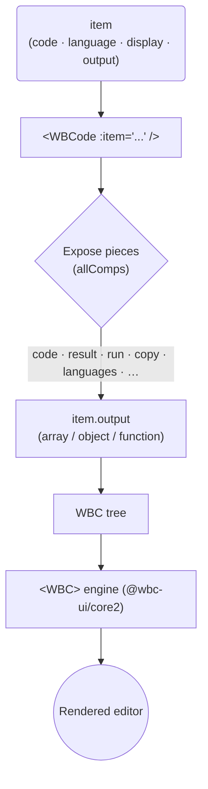

<p align="center">
  
</p>

<p align="center">
  <strong>Code as Data. Vue 2. Live.</strong><br/>
  <em>One JSON <code>item</code> describes an entire editor — language, panels, toolbars, layout. Live editing, live previews, live execution. Ship a runnable code surface in minutes, not weeks.</em>
</p>

<p align="center">
<a href="https://www.npmjs.com/package/@wbc-ui/code2"></a>
<a href="https://www.npmjs.com/package/@wbc-ui/code2?activeTab=versions"></a>
<a href="https://github.com/wbc-ui/code2/blob/main/LICENSE"></a>
<a href="https://vuejs.org"></a>
</p>

<p align="center">
  <a href="https://wbcode2.wbc-ui.com">📘 Docs</a> ·
  <a href="https://github.com/wbc-ui/code2">🐙 GitHub</a> ·
  <a href="https://code2.wbc-ui.com">▶️ Playground</a> ·
  <a href="https://wbc-ui.com">💎 Pro</a>
</p>

---

## Why?

**@wbc-ui/code2** replaces the bespoke "embed a code editor" stack — Monaco wiring, per-language config, custom toolbars, a preview pane, a run sandbox — that every docs site, tutorial platform, and dev portal rebuilds from scratch.

### Write an editor in one component

```javascript
// Before: Monaco init, language workers, toolbar markup, preview pane, run sandbox
// After: one <WBCode>, driven by data.
<WBCode :item="{ code: \"console.log('Hello, WBCode!')\" }" />
```

That alone gives you a syntax-highlighted editor with copy, fullscreen, and download. Every key in `item` is optional — defaults give a sensible single-pane JS editor.

### The output IS a WBC tree

`<WBCode>`'s entire rendered output is a [`@wbc-ui/core2`](https://www.npmjs.com/package/@wbc-ui/core2) WBC tree. The toolbars, panels, output area, footer, and result viewer are all named pieces you compose with plain data — exactly like composing Vuetify through WBC.

```javascript
// Pick the pieces, arrange them — no forking the component.
item.output = ['h3__Result', 'code', 'result'];
```

### Host-owned config, package-owned UI

```javascript
// Your backend ships "the right editor shape" per page. No frontend release.
{ code: '# Lesson 1', language: 'markdown', display: ['code', 'preview'], autoUpdate: ['preview'] }
```

> **One component. One `<WBCode>` tag.** No Monaco boilerplate. No per-language wiring. Everything is data.

---

## What is @wbc-ui/code2?

A **Vue 2.7+ component** — `<WBCode>` — whose entire output is a WBC tree. It pairs with `@wbc-ui/core2` (the WBC engine) and turns a single JSON `item` into a composable, runnable, restylable editor.

| Surface | Role |
|---|---|
| `<WBCode :item="...">` | The renderer — editor, toolbars, panels, output, footer, all composed from `item` |
| `item` descriptor | Host-owned data shape: `code`, `language`, `display`, `autoUpdate`, toolbars, `output`. Stable contract |
| `item.output` | The composable layout — picks `allComps` pieces and arranges them as a WBC tree |
| `allComps` catalogue | Named pieces (`code`, `result`, `htmlOutput`, `run`, `copy`, `languages`, …) you reference from `output` |

**Who's it for?** Docs sites with runnable snippets, e-learning / coding-course platforms, internal dev portals, multi-language sandboxes, and notebook- or converter-style tools — anyone who needs **runnable, restylable, JSON-driven editors** rather than yet another textarea.

> **Prerequisite knowledge.** `<WBCode>` reads and writes a WBC tree, so being comfortable with `@wbc-ui/core2` pays back immediately. See [wbc-ui.com](https://wbc-ui.com).

---

## Teasing Examples

### Level 1 — Hello, WBCode
```html
<WBCode :item="{ code: \"console.log('Hello, WBCode!')\" }" />
```
→ A syntax-highlighted editor with copy, fullscreen, and download. ½ second of typing.

### Level 2 — Markdown editor with live preview
```javascript
{
  code: '# Hello WBCode',
  language: 'markdown',
  display: ['code', 'preview'],
  autoUpdate: ['preview'],
  topBar: [['languages'], ['copy', 'dark', 'fullscreen', 'download']],
}
```

### Level 3 — Live runner with a custom layout
```javascript
{
  code: "for n in fibonacci(10):\n    print(n)",
  language: 'python',
  filename: 'fib.py',
  output: [
    ['<~VRow,grey lighten-3 pa-5 my-5 rounded>',
      'upload', '<VSpacer>', 'run', '<VSpacer>', 'copy', 'download'],
    'h3__Your code|deep-purple--text',
    'code',
    'h3__Output|teal--text',
    ['<~VCard,blue lighten-5 pa-6 rounded>', 'result'],
  ],
}
```
→ Because `output` is a WBC tree, you compose WBCode pieces (`upload`, `run`, `code`, `result`) with WBC primitives (`<~VRow,pa-5>`, `h3__…|…--text`) freely.

---

## The `item` prop

Every key is optional — defaults give a sensible single-pane JS editor.

| Key | Type | Purpose |
|---|---|---|
| `code` | `string` or `function(self)` | The source code itself. |
| `language` | `string` | Initial syntax language (`'javascript'`, `'python'`, `'markdown'`, …). |
| `languages` | `string` (comma-separated) | Languages the user can switch between via the `languages` chip. |
| `filename` | `string` | Shown in the filename badge; used as the download name. |
| `display` | `string[]` | Visible panels. Subset of `['code', 'preview', 'html', 'markdown', 'formatter', 'result']`. |
| `autoUpdate` | `string[]` | Which panels refresh as the user types. |
| `full` | `boolean` | Enable every panel and toolbar button (kitchen sink). |
| `topBar` / `codeBar` / `outputBar` / `footBar` | `(string \| object)[][]` | Toolbar rows. Each inner array is a button group. |
| `patcher` | `object` | Inject content before / after / around individual panels. |
| `output` | `array` \| `object` \| `function` | **The composable layout** — see below. |
| `samples` | `object` | Pre-canned snippets per language, surfaced through the `samples` button. |

---

## The real superpower: `item.output`

`item.output` builds `<WBCode>`'s rendered tree as a WBC item. Internally WBCode exposes every piece as a named slot via `allComps`; `output` picks which pieces to render and how to arrange them.

Common `allComps` keys: `code`, `result`, `htmlOutput`, `mdOutput`, `toFormat`, `upload`, `run`, `copy` / `download` / `share` / `edit` / `format` / `palette` / `search`, `dark` / `fullscreen` / `zoom` / `float` / `closeCode`, `languages`, `samples`, `filename`, `showCode` / `showPreview` / `showHtml` / `showMd`, `mainEditor`.

### Three forms

**1. Array** — siblings, rendered in order. Each entry is an `allComps` key or a WBC fragment (`'<~VRow,pa-4>'`, `'h3__Title|primary'`, a `{ comp, options }` object, …).

```javascript
output: ['h3__Result', 'code', 'result']
```

**2. Object** — keys define order. Numeric keys come first (sorted), then named keys preserve insertion order.

```javascript
output: { 0: 'h3__Source', 1: ['copy', 'download'], main: 'code', footer: ['result'] }
```

**3. Function** — full programmatic control. Receives `allComps`, returns a WBC tree.

```javascript
output: (allComps) => ({
  options: { class: 'pa-2' },
  0: allComps.topBar,
  1: ['<~VRow>', '<VCol>', allComps.code, '<VCol>', allComps.result],
  2: allComps.footBar,
})
```

Because `output` is a WBC tree, you can use **every WBC primitive** inside it. WBCode composes its own pieces and your elements freely.

### Composing with WBC

`<WBCode>` and `<WBC>` are reciprocal:

```javascript
// Render a WBCode editor from inside a WBC tree:
{ comp: 'WBCode', options: { item: { code: "print('hi')", language: 'python' } } }
```
```html
<!-- Wrap any WBC item in a WBCode editor with the wbCode prop: -->
<WBC :item="anyItem" :wbCode="true" />
```

---

## 🚀 Try it in 30 seconds

```bash
# Live interactive lab — paste any item JSON, see the editor render
open https://code2.wbc-ui.com
```

> The fastest way to explore the component is the live demo at **[code2.wbc-ui.com](https://code2.wbc-ui.com)** — build an `item`, see it render in real time, copy the integration snippet back to your project. Full reference at **[wbcode2.wbc-ui.com](https://wbcode2.wbc-ui.com)**.

---

## Installation

### Prerequisites

- **Node.js** ≥ 18 (older versions may work but are not tested)
- **Vue 2.7.x** (the component targets Vue 2 specifically; Vue 3 tracked separately as `@wbc-ui/code3`)
- **[`@wbc-ui/core2`](https://www.npmjs.com/package/@wbc-ui/core2)** — the WBC engine `<WBCode>` renders into (brings the Vuetify peer expectations)
- A bundler that understands ESM exports: Vite (recommended), Webpack 5, or Vue CLI 5

### npm (recommended)

```bash
npm install @wbc-ui/core2 @wbc-ui/code2

# Peer dependencies — install once per project
npm install vue@^2.7.16 vuetify@^2.7.2
```

### Yarn / pnpm

```bash
# Yarn
yarn add @wbc-ui/core2 @wbc-ui/code2
yarn add vue@^2.7.16 vuetify@^2.7.2

# pnpm
pnpm add @wbc-ui/core2 @wbc-ui/code2
pnpm add vue@^2.7.16 vuetify@^2.7.2
```

### Vue 2 plugin registration

```javascript
// main.js
import Vue from 'vue';
import Vuetify from 'vuetify';
import wbcCore from '@wbc-ui/core2';      // always first — code2 registers into it
import WBCodePack from '@wbc-ui/code2';

Vue.use(Vuetify);
Vue.use(wbcCore, { context: require.context('.', true) });
Vue.use(WBCodePack);
// Use <WBCode :item="..."> anywhere in your app.
```

### Hello, WBCode

The entire usage is **one line** — `item` describes everything:

```html
<WBCode :item="{ code: \"console.log('Hello, WBCode!')\" }" />
```

### Troubleshooting common install errors

| Symptom | Cause | Fix |
|---|---|---|
| `Vue.use is not a function` | Two copies of Vue are loaded (your app has Vue 2, a dependency hoisted Vue 3) | Pin a single Vue: `"resolutions": { "vue": "^2.7.16" }` (yarn/pnpm) or npm `overrides`, then reinstall. |
| `Cannot find module '@wbc-ui/code2'` | npm couldn't resolve the package | Confirm install: `npm ls @wbc-ui/code2`. If empty, `npm install @wbc-ui/code2@latest`. |
| `<WBCode>` renders but is unstyled | Vuetify CSS isn't loaded | Import once in `main.js`: `import 'vuetify/dist/vuetify.min.css';` |
| `WBCode is not a registered component` | `@wbc-ui/core2` was registered but `@wbc-ui/code2` wasn't | Add `Vue.use(WBCodePack)` **after** `Vue.use(wbcCore)`. |
| Python / Ruby code won't run | Browser runtimes (Pyodide / Opal) lazy-load and are heavyweight | Expected — keep them off the critical path; JavaScript runs natively. |

For a longer walkthrough with worked examples, see the documentation hub at [wbcode2.wbc-ui.com](https://wbcode2.wbc-ui.com).

---

## ⚡ The Component Under the Hood

<details>
<summary>Mermaid diagram (interactive fallback)</summary>
<div align="center">



</div>
</details>

- **Output is a WBC tree** — every toolbar, panel, and viewer is a named `allComps` piece you arrange with data
- **Three `output` forms** — array (siblings), object (ordered keys), or function (full programmatic control)
- **Reciprocal with `<WBC>`** — embed WBCode in a WBC tree, or wrap any WBC item in an editor via `:wbCode="true"`
- **Browser execution** — JavaScript runs natively; Python (Pyodide) and Ruby (Opal) lazy-load on demand

---

## 💎 Free vs Pro

> **`@wbc-ui/code2` is open-source and a complete editor today** — editing, syntax highlighting, previews, the toolbar catalogue, and the full `item.output` composition model are free. The Pro lane is narrow and demand-driven; it follows the same open-core tiering as the underlying [`@wbc-ui/core2`](https://www.npmjs.com/package/@wbc-ui/core2) engine.

| Capability | Free | Pro |
|---|---|---|
| `<WBCode>` editing, highlighting, copy / download / fullscreen | ✅ Full | ✅ Full |
| Panels (`code`, `preview`, `html`, `markdown`, `formatter`, `result`) | ✅ Full | ✅ Full |
| Composable `item.output` (array / object / function) | ✅ Full | ✅ Full |
| Multi-language editing + in-browser run (JS native; Pyodide / Opal lazy) | ✅ | ✅ |
| Depth / item caps on the rendered WBC tree | core2 free caps | ∞ (via core2 Pro) |
| Advanced engine hooks & headless extraction | — | ✅ (via core2 Pro) |

👉 **[Compare in detail →](https://wbc-ui.com/free-vs-pro)** · **[Buy Pro →](https://wbc-ui.com/pricing)**

---

## 🌐 Ecosystem

`@wbc-ui/code2` is a sibling package in the **@wbc-ui** monorepo. Every package is published to npm and shares the same versioning line.

| Package | What it adds | Status |
|---|---|---|
| [`@wbc-ui/core2`](https://www.npmjs.com/package/@wbc-ui/core2) | "UI as Data" engine — the foundation | 🟢 GA |
| **[`@wbc-ui/code2`](https://www.npmjs.com/package/@wbc-ui/code2)** | **JSON-driven code editor + live run** *(this package)* | 🟢 GA |
| [`@wbc-ui/chart2`](https://www.npmjs.com/package/@wbc-ui/chart2) | ECharts integration | 🟢 GA |
| [`@wbc-ui/dataviewer2`](https://www.npmjs.com/package/@wbc-ui/dataviewer2) | JSON / data-table explorer | 🟢 GA |
| [`@wbc-ui/latex2`](https://www.npmjs.com/package/@wbc-ui/latex2) | LaTeX math rendering | 🟢 GA |
| [`@wbc-ui/mermaid2`](https://www.npmjs.com/package/@wbc-ui/mermaid2) | Diagram-as-code rendering | 🟢 GA |
| [`@wbc-ui/alert2`](https://www.npmjs.com/package/@wbc-ui/alert2) | Notification / toast system | 🟢 GA |
| [`@wbc-ui/press2`](https://www.npmjs.com/package/@wbc-ui/press2) | Markdown-driven docs engine | 🟢 GA |

---

## Build artifacts

| Format | File |
|---|---|
| ESM | `dist/code2.es.js` |
| UMD | `dist/code2.umd.js` |

> CSS is injected by JS at runtime (no separate stylesheet to import).

---

## 📄 License

MIT © [Wissem Boughamoura](https://github.com/wissemb11) · [wi-bg.com](https://www.wi-bg.com) · [wbc-ui.com](https://wbc-ui.com)
